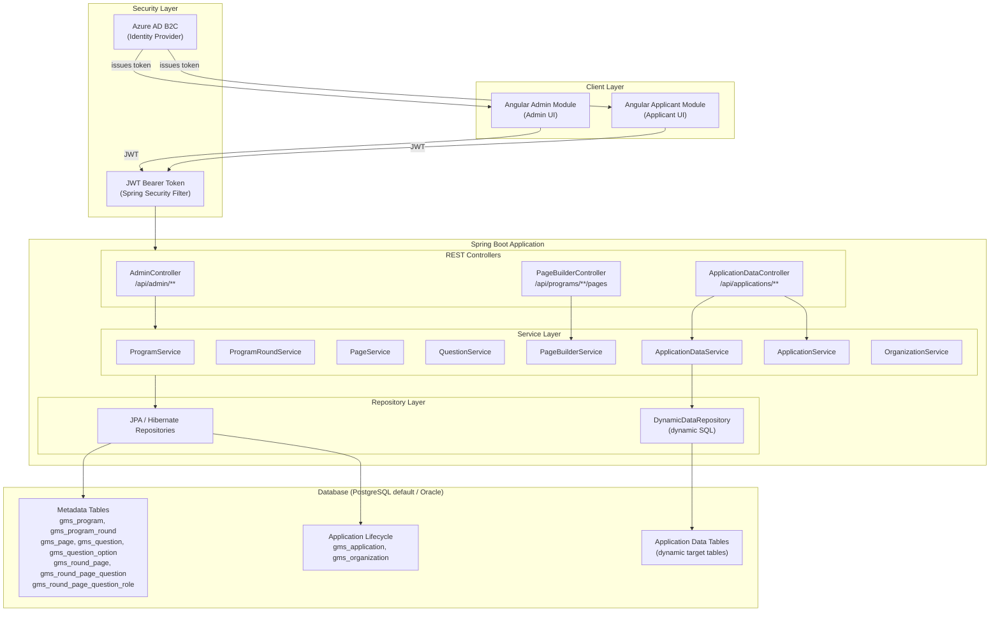
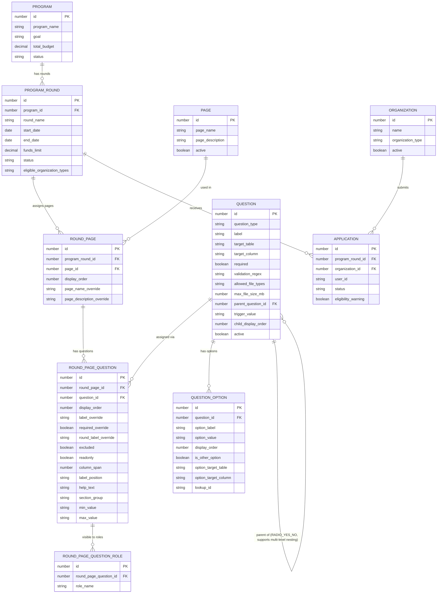
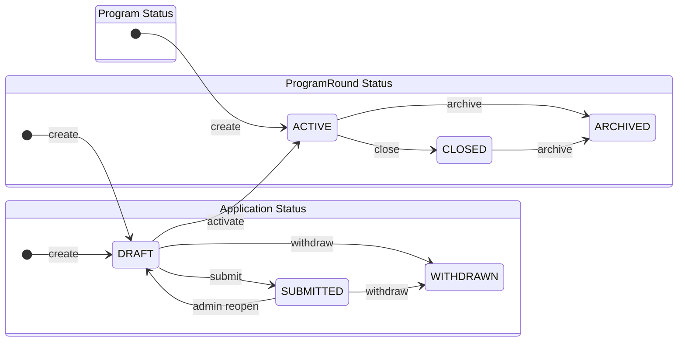
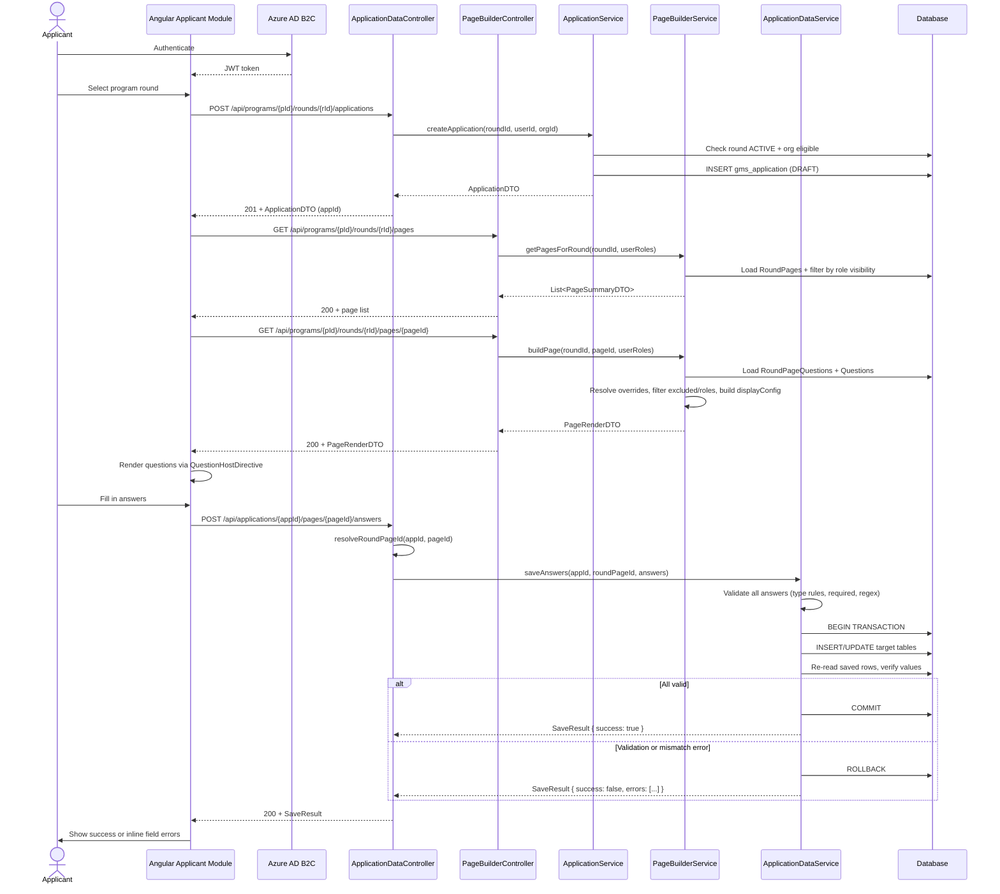
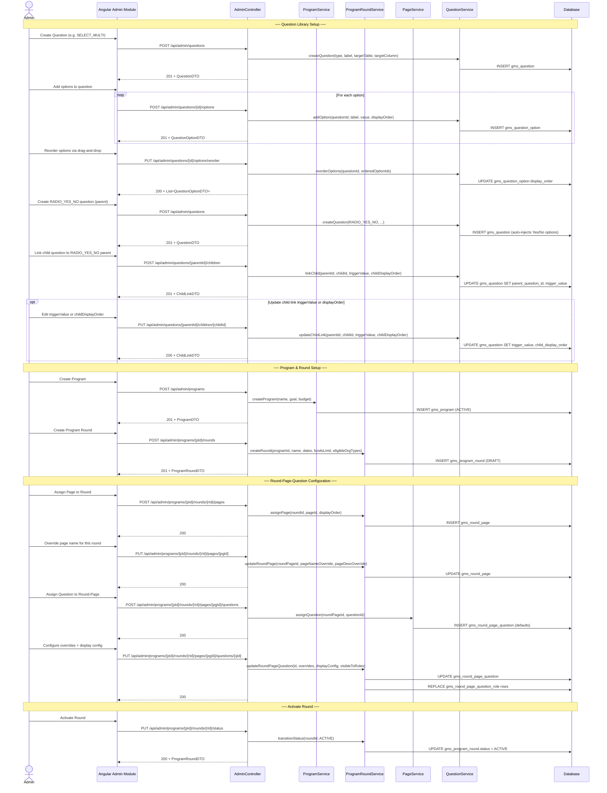
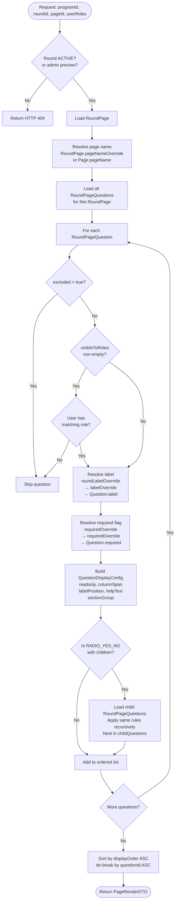
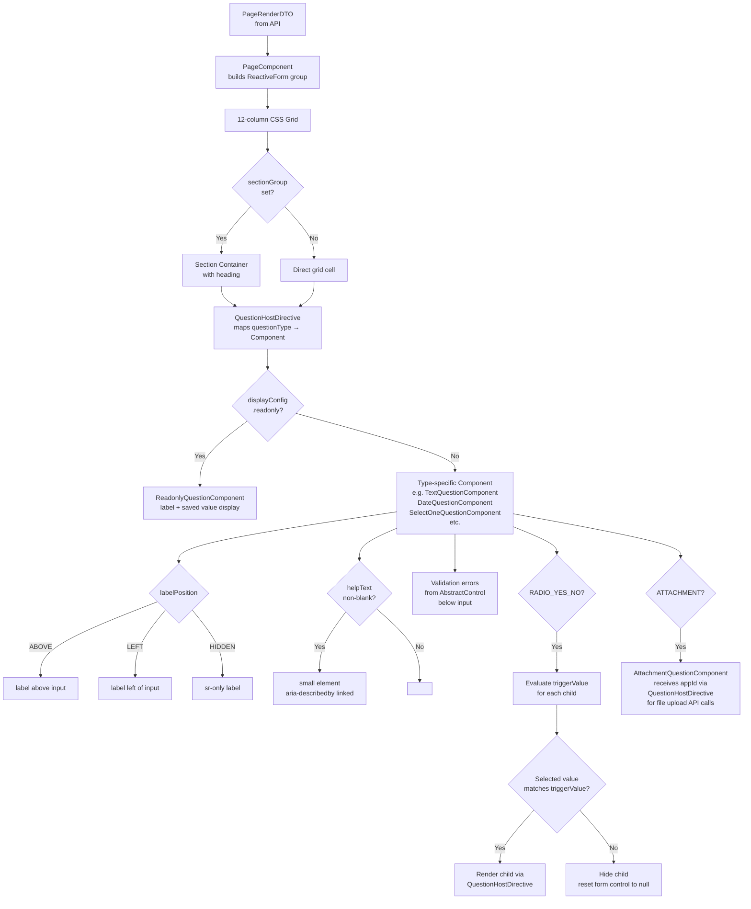
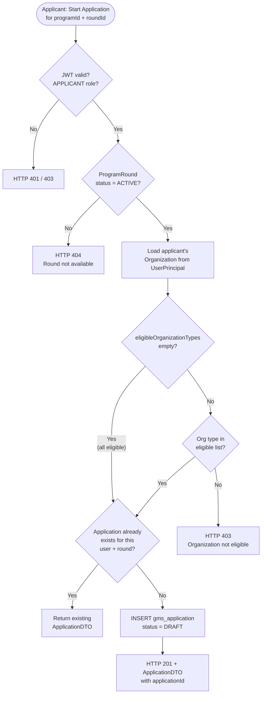

# Grant Management Base Framework — Architectural Diagrams

---

## 1. System Architecture Overview

High-level view of the technology layers, external dependencies, and how they connect.

---

## 2. Domain Model Hierarchy

How the core domain entities relate to each other.

---

## 3. Status Lifecycles

---

## 4. Applicant Journey — Request Flow

End-to-end flow from an applicant loading a form page to saving answers.

---

## 5. Admin Configuration Flow

How an administrator sets up a program round with pages and questions, including option and child-link management.

---

## 6. PageBuilderService — Override Resolution

Internal logic of how the PageBuilderService assembles a PageRenderDTO.

---

## 7. Angular Component Architecture

How the Angular Applicant Module renders a page using the component-per-type model.

---

## 8. Organization Eligibility and Application Creation

Decision flow when an applicant attempts to start an application.

---
